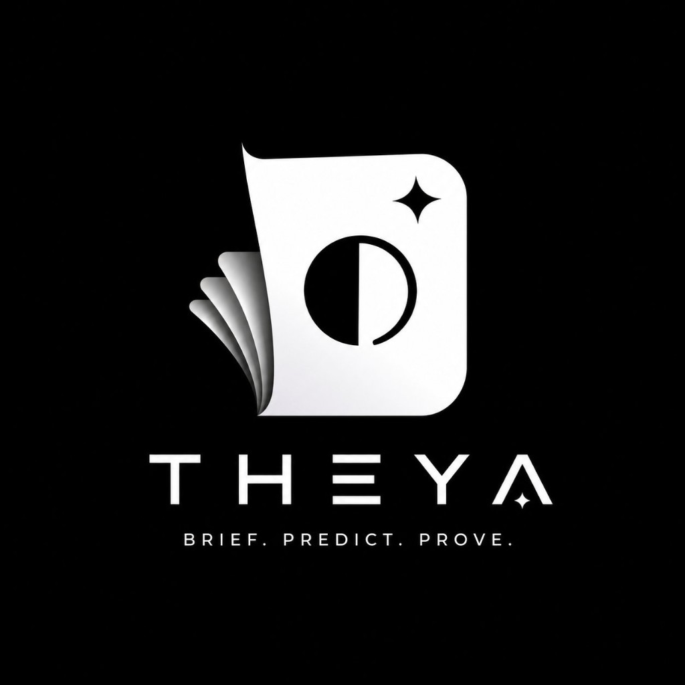

# THEYA



THEYA turns categorized news briefs into transparent, fixed-stake prediction
markets on Monad. Read a brief, inspect its source and resolution rules, then
take one YES or NO position before midnight IST.

## Live testnet

- App: https://theyabrief.vercel.app
- Portfolio: https://theyabrief.vercel.app/portfolio
- Market contract: [`0xc2aFe3b927B6F4BD3889F7e21e5A79C5C1F9f5B8`](https://testnet.monadvision.com/address/0xc2aFe3b927B6F4BD3889F7e21e5A79C5C1F9f5B8)
- Resolver/deployer: `0xcD1Bc1C4BC2e53c44122ce675E86E165Ab4473f4`
- ERC-8004 agent ID: `1821`
- Paid evidence audit: `https://theyabrief.vercel.app/api/oracle/audit?marketId=1`

Testnet only. Test MON has no monetary value.

## How it works

1. Browse Top, World, Politics, Business, Technology, Science, Health, Sports,
   Entertainment, and Crypto briefs.
2. Open the original publisher and declared resolution source.
3. Connect an EVM wallet on Monad Testnet.
4. Choose YES or NO and lock one `0.01 MON` position.
5. Return after resolution to claim a winning payout or refund.

Each wallet gets one position per market. A losing position loses its stake.
Winners recover their stake and split 90% of the losing pool; the remaining 10%
is protocol revenue. One-sided and conservatively voided markets refund stakes.
Every market closes at `00:00 Asia/Kolkata` after its article's publication day.

## Portfolio

`/portfolio` reads a wallet's complete indexed market history from the contract.
It shows total staked, settled profit/loss, open exposure, claimable MON, and
ongoing/won/lost/void positions. Open positions never show speculative
unrealized profit.

## News and evidence policy

Mainstream categories use direct BBC News, BBC Sport, and NPR RSS feeds. Crypto
uses direct feeds from CoinDesk, The Block, Decrypt, Blockworks, The Defiant,
and Bitcoin Magazine.

THEYA accepts only HTTPS article URLs on configured publisher domains, removes
duplicates, assigns categories from feed configuration, and never invents
fallback stories. Market metadata and deadlines come from validated feed data.
The automated resolver can use only same-publisher evidence published by the
cutoff. Missing, late, conflicting, low-confidence, or unrecognized evidence
produces a VOID result.

RSS availability does not grant commercial republication rights. Review each
publisher's terms before production or commercial use.

## Stack

- Next.js 16, React 19, TypeScript, Tailwind CSS
- Wagmi and Viem for Monad Testnet interaction
- Solidity and Foundry for `TheyaMarket`
- ERC-8004 identity for the resolver
- x402 v2 for paid, independent evidence audits
- Playwright for responsive browser tests

## Local development

Requirements: Node.js 22+, npm, and Foundry.

```bash
npm install
cp .env.example .env.local
npm run dev
```

Set a non-zero `NEXT_PUBLIC_CONTRACT_ADDRESS` to load live briefs and
portfolios. Secrets remain server-only; never expose deployer or resolver keys
through `NEXT_PUBLIC_*` variables.

## Contract deployment

```bash
npm run test:contract
cd contracts
forge script script/Deploy.s.sol:Deploy --rpc-url monad_testnet --broadcast
```

Verify the deployment:

```bash
forge verify-contract \
  --chain-id 10143 \
  --rpc-url https://testnet-rpc.monad.xyz \
  --verifier sourcify \
  --verifier-url https://sourcify-api-monad.blockvision.org/ \
  CONTRACT_ADDRESS src/FlashMarket.sol:TheyaMarket \
  --constructor-args "$(cast abi-encode 'constructor(address,address,address)' CREATOR RESOLVER FEE_RECIPIENT)"
```

Fund the configured deployer/resolver with test MON from
https://faucet.monad.xyz. Split creator, resolver, fee recipient, and owner roles
before production.

## Automation

Vercel calls `/api/agent/create` at 00:00, 06:00, 12:00, and 17:00 UTC, then
`/api/agent/resolve` at 19:00 UTC after the 18:30 UTC midnight-IST cutoff.
Both routes require `Authorization: Bearer $CRON_SECRET`; duplicate article
hashes make creation idempotent.

## ERC-8004 and x402

Resolver registration document:
https://theyabrief.vercel.app/api/agent-card

ERC-8004 is still Draft. Identity proves registration and wallet ownership, not
resolution correctness. Monad Testnet currently exposes identity and reputation
registries; this project does not claim Validation Registry support.

The closed-market audit endpoint charges exact `0.001` test USDC through x402 v2
on `eip155:10143`, then returns a fresh decision, citations, confidence, and
audit hash without settling the market. Test USDC is available from
https://faucet.circle.com.

## Verification

```bash
npm run check
npm run test:e2e
```

`npm run check` runs lint, TypeScript, Foundry tests, and a production build.
Playwright deploys a fresh local contract, seeds all categories and portfolio
states, injects a test wallet, and verifies desktop, tablet, 320/375/390/430 px
phone, PWA, auth, ERC-8004, and x402 behavior.

Event betting can be regulated. Mainnet use requires legal review, independent
contract audits, licensed content, operational monitoring, and measured gas
economics.
